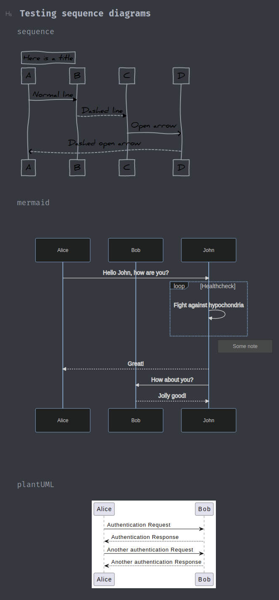

Due to different options to handle markdown defined diagrams in local environment and github support only Mermaid engine from three tested is able to render diagrams on github.

Result for local editor:

