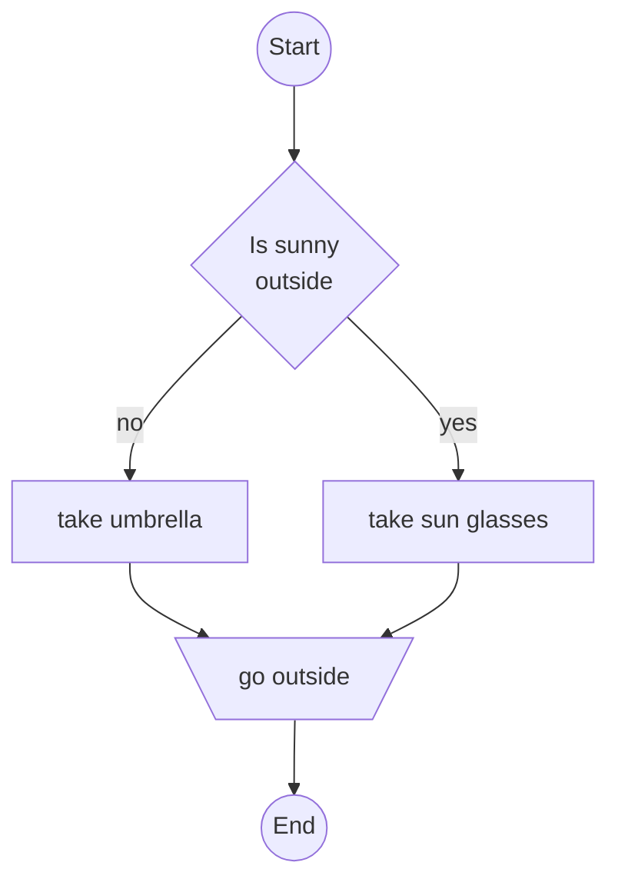

###### Mermaid type flow graph testing


```mermaid
flowchart TD
  id1((Start))
  id2{Is sunny\n outside}
  id3[take umbrella]
  id4[take sun glasses]
  id5[\go outside/]
  id6((End))
  id1-->id2
  id2-->|no|id3
  id2-->|yes|id4
  id3 & id4-->id5-->id6

```

```flowchart
st=>start: Start|past
e=>end: End|future
op1=>peration:My operation|past
st->e
```
